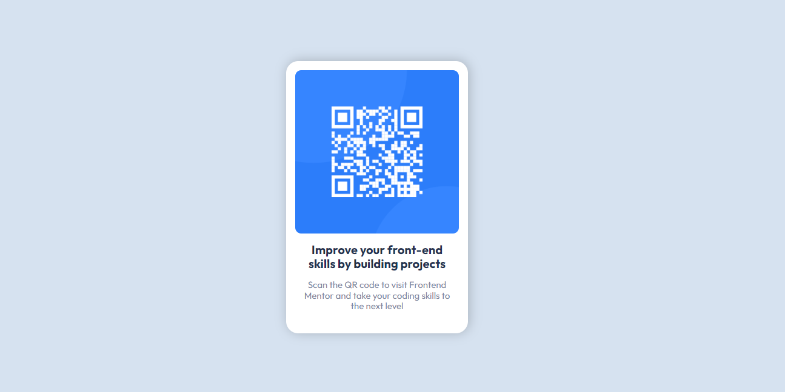

# Frontend Mentor - QR code component solution

This is a solution to the [QR code component challenge on Frontend Mentor](https://www.frontendmentor.io/challenges/qr-code-component-iux_sIO_H). Frontend Mentor challenges help you improve your coding skills by building realistic projects. 

### Screenshot

### Built with

- Semantic HTML5 markup
- CSS custom properties
- Flexbox
- Mobile-first workflow

### What I learned

Reinforce my knowledge using flexbox. I learned how to create components so that, regardless of where they are used, they maintain their structure.

### Continued development

In future projects, I hope to continue improving my layout creation skills using both grid and flexbox.

